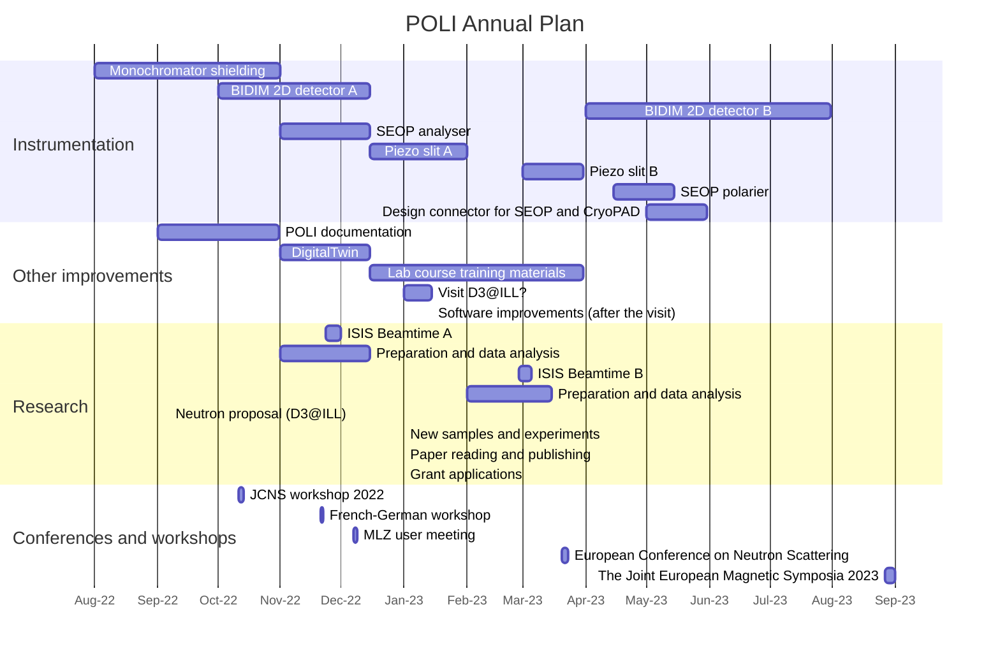
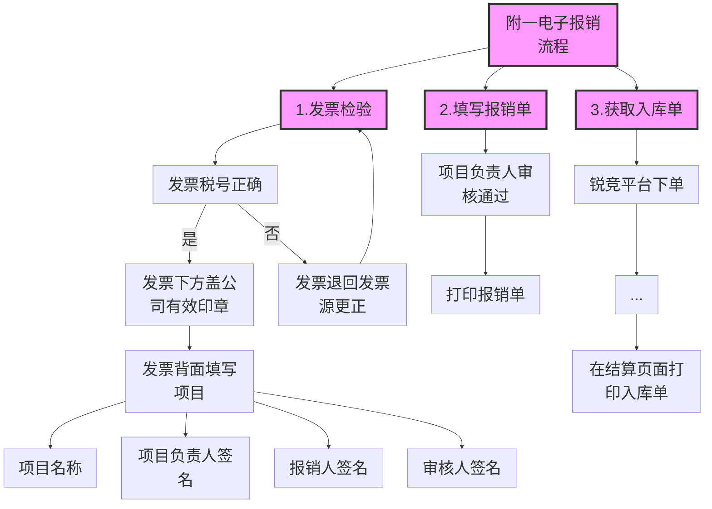

# Using Mermaid
for live editor
```json
{
  "theme": "default",
  "fontsize": 10,
  "gantt": {
      "titleTopMargin": 25,
      "barHeight": 20,
      "barGap": 4,
      "topPadding": 50,
      "leftPadding": 75,
      "gridLineStartPadding": 35,
      "fontSize": 15,
      "numberSectionStyles": 5
    }
}
```




# Using Pintora
https://pintorajs.vercel.app/docs/diagrams/gantt-diagram/

```pintora
gantt
  @param barHeight 16
  @config({
    "gantt": {
      "barBackground": "#F2C1C1",
      "sectionBackgrounds": ["#ccdd77", "#EAF4AF", null],
      "sectionLabelColor": "#00000",
      "axisLabelFontSize": 10,
      "fontSize": 12, 
      "sectionFontSize": 14
    }
  })

dateFormat  YYYY-MMM-DD
axisFormat DD-MMM-YY
axisInterval 1M
title POLI Annual Plan

section  Instrumentation
Monochromator shielding                    : 2022-08-01,2022-11-01
BIDIM 2D detector A                        : 2022-10-01,2022-12-15
BIDIM 2D detector B                        : 2023-04-01,2023-07-31
SEOP analyser                              : 2022-11-01,2022-12-15
Piezo slit A                               : 2022-12-15,2023-02-01
Piezo slit B                               : 2023-03-01,2023-03-31
SEOP polarier                              : 2023-04-15,2023-05-15
Design connector for SEOP and CryoPAD      : 2023-05-01,2023-05-31

section Other improvements
POLI documentation                         : 2022-09-01,2022-10-31
DigitalTwin                                : 2022-11-01,2022-12-15
Lab course training materials              : 2022-12-15,2023-03-31
Visit D3@ILL?                              : des1, 2023-01-01, 14d
Software improvements (after the visit)    : after des1, 0d

section Research
ISIS Beamtime A                            : 2022-11-23,2022-12-01
Preparation and data analysis              : 2022-11-01,2022-12-15
ISIS Beamtime B                            : 2023-02-27,2023-03-05
Preparation and data analysis              : 2023-02-01,2023-03-15
Neutron proposal (D3@ILL)                  : 2022-09-07, 0d
New samples and experiments                : 2023-01-01, 0d
Paper reading and publishing               : 2023-01-01, 0d
Grant applications                         : 2023-01-01, 0d

section Conferences and workshops
JCNS workshop 2022                        : 2022-10-11, 2022-10-14
French-German workshop                    : 2022-11-21, 2022-11-22
MLZ user meeting                          : 2022-12-07, 2d
European Conference on Neutron Scattering : 2023-03-20, 2023-03-23
The Joint European Magnetic Symposia 2023 : 2023-08-27, 2023-09-01
```

# Mermaid example

