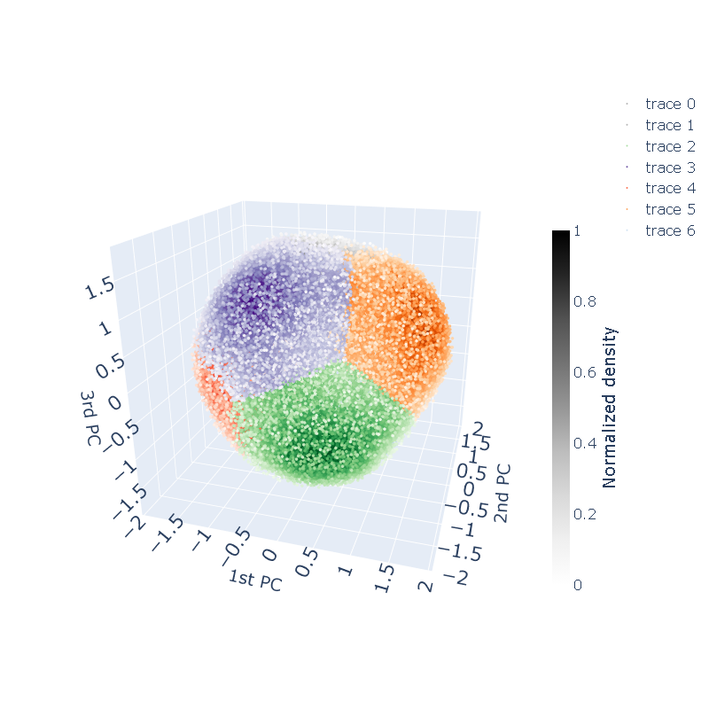
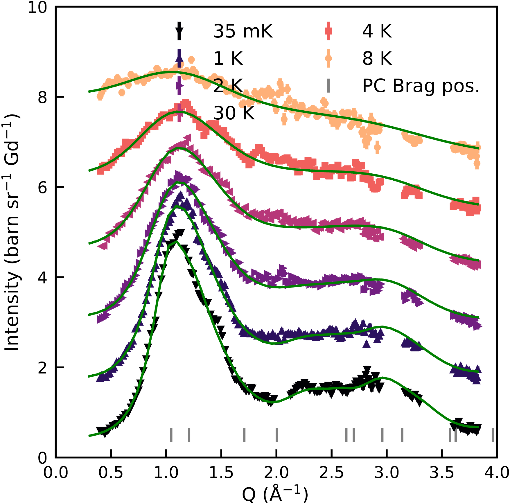
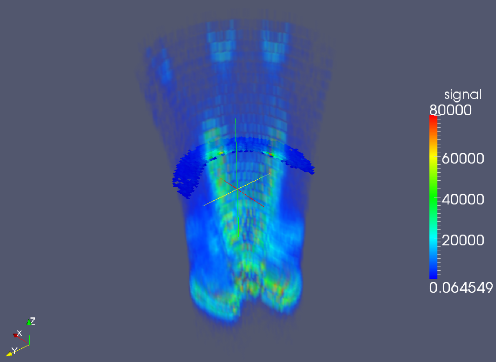
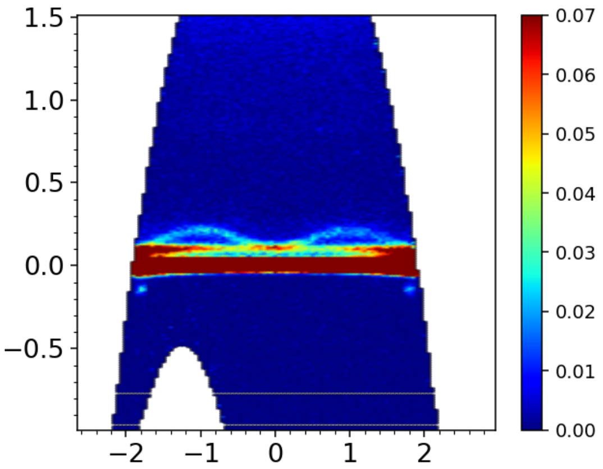
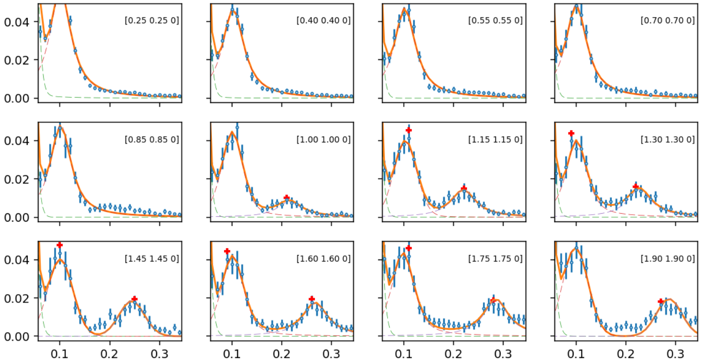
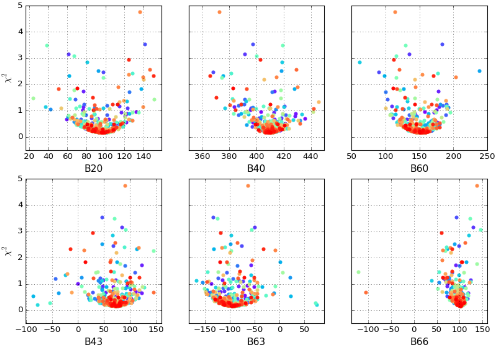
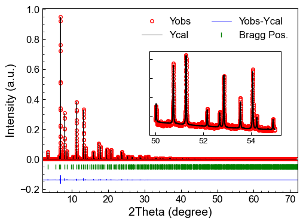

# Scientific Data Analysis  

This repository tracks my scientific data analyses conducted during my research as a condensed matter physicist. It covers a wide range of topics related to analyzing data from materials in polycrystalline and single-crystalline forms, including:  

- **Physical property measurements** (susceptibility, magnetization, specific heat)  
- **Crystal structure analysis** (neutron and X-ray diffraction)  
- **Neutron scattering** (diffuse scattering for short-range correlations, inelastic scattering for excitations)  

I am highly enthusiastic about **programming and data analysis**, utilizing different programming languages (**Python, MATLAB, Mathematica, Julia, C**) and software tools, selecting the best approach for each problem.  

I am sharing these works to encourage discussion and feedback. I hope they are useful to others. Below are some highlights—there's much more to explore in this repository!  

---

## 🔍 Machine Learning for Short-Range Spin Correlations in Gd₂Hf₂O₇  

A conventional approach to identifying spin correlations in a magnetic system involves defining multiple order parameters based on prior knowledge—an experience-dependent process.  

In this project, I applied **unsupervised machine learning** to automatically identify dominant correlation patterns in the data.  

- **Blog post:** [Machine Learning Correlations](https://jh-xu.github.io/posts/Machine-learning-correlations-of-vectors)  
- **Code:** [Machine Learning Analysis](./Reverse_Monte_Carlo_analysis/Gd2Hf2O7/Machine_learning.ipynb)  

I also attempted a **statistical analysis** by measuring angles between vectors. While it produced similar results, it was less efficient and less coder-friendly.  

- **Code:** [Statistical Analysis](./Reverse_Monte_Carlo_analysis/Gd2Hf2O7/Statistical_analysis_of_local_vector_patterns.ipynb)

| Data projected into the reduced space formed by the first three principal components, clustered with using KMeans. Each cluster in a color represents a type of correlation pattern. |
|:------:|
|  |

---

## 📊 Mean-Field Analysis of Neutron Diffuse Scattering of Classical Spin Liquids  

**Mean field theory (MFT)** was originally developed over a century ago to study high-dimensional stochastic models. It has since been applied across various fields.  

In this project, I used **MFT to analyze neutron diffuse scattering data**, a computationally demanding task requiring extensive spherical averaging. To optimize performance, I implemented the calculations using the [Numba Python compiler](https://numba.pydata.org/) on a **high-performance computing (HPC) cluster**.  

- **Code:** [MFT Analysis](./Reverse_Monte_Carlo_analysis/Gd2Hf2O7/Mean_field_analysis_with_Python_at_RWTH_HPC_center/Mean_field.ipynb)  

| Diffuse neutron scattering data and MFT fit at different temperatures | Calculated scattering pattern for a pyrochlore antiferromagnet|
|:---------:|:---------:|
|  |  |

---

## 🌀 Exploring Large 4D Neutron Spectroscopy Datasets (~100GB)  

Modern **time-of-flight neutron spectrometers** generate massive four-dimensional datasets (momentum & energy). Manually slicing and cutting through such data is time-consuming, labor-intensive, and requires significant expertise.  

To streamline this process, I developed an **automated Python pipeline** that:  

✅ Loads and processes data  
✅ Performs peak detection and fitting  
✅ Exports results for further analysis  

- **Code:** [4D Data Analysis](./Nd2Zr2O7_spinwave_neutron/Nd2Hf2O7_IN5_spinwave_fit.ipynb)  
- **Publication:** [Phys. Rev. B](https://journals.aps.org/prb/abstract/10.1103/PhysRevB.106.L100401)  

|3D volume data cut from a 4D dataset (source: [MantidProject](https://mantidproject.org/File_SpinWavesDE.html)).|A slice of the 4D dataset.|
|:---:|:---:|
|||

<figure>
  <figcaption><b>Cuts and peak fits of the 4D data.</b>
  
  </figcaption>
</figure>

---

## 🔬 Automating Crystal Field Analysis  

[SPECTRA](https://www.physics.ox.ac.uk/our-people/boothroyd/software) is a widely used tool for analyzing **crystal electric field interactions**. However, its outdated **command-line interface** requires manual input of dozens of parameters—one by one—making it tedious and error-prone.  

To improve efficiency, I automated the interaction process using **Python + Pexpect + Re**, allowing for batch processing and systematic exploration of parameter space.

- **Code:** [Automation Script](./Crystal_field/Sm2Zr2O7_Winpexpect_call_Spectre.ipynb)  

<figure>
    <figcaption><b>Fitted crystal field parameters from 700 independent runs.</b></figcaption>
  
</figure>  

---

## ⚙️ X-ray/Neutron Diffraction Analysis  

X-ray and neutron diffraction are standard techniques for determining and refining crystal structures. To automate the visualization of diffraction fits, I developed a Python script to **load and plot [FullProf](https://www.ill.eu/sites/fullprof/) fit results in one step**, significantly improving workflow efficiency.  

- **Code:** [Diffraction Plotting Script](./Diffraction_data_read_plot/Fullprof_read_plot_prf.ipynb)  

<figure>
  <figcaption><b>Automatically plotted fitted diffraction data.</b></figcaption>
  

</figure>  

---

## ⚡ Skills & Tools  

### 🛠 Programming Languages:  
- Python, MATLAB, Mathematica, Julia, C  

### 📚 Libraries & Frameworks:  
- NumPy, SciPy, Matplotlib, scikit-learn, Numba, Pexpect, Joblib, VPython, Plotly  

### 🔬 Computational Techniques:  
- Machine learning for pattern recognition  
- HPC & parallel computing for large-scale simulations  
- Automated data processing pipelines  
- Advanced visualization techniques  

---